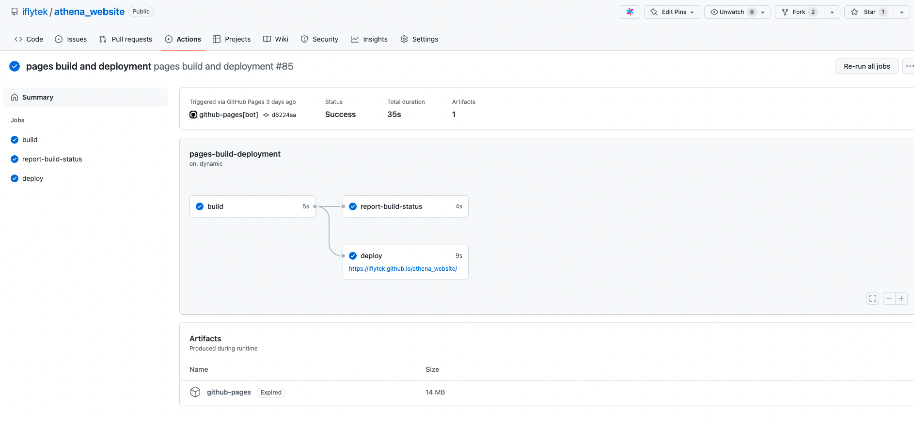
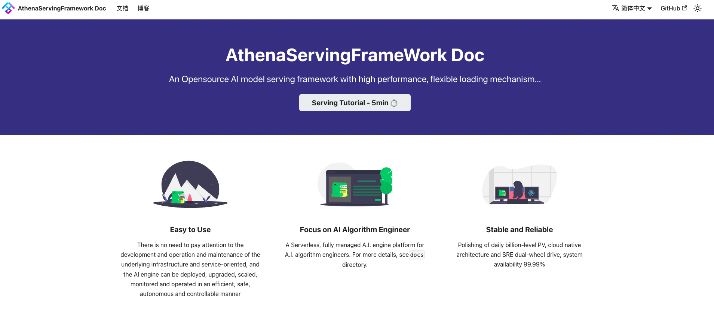

# 讯飞开源背景

随着近几年开源的蓬勃发展，开源的影响力在业内也是广泛被认可。以BAT为首的各行业的企业都在开源领域内发展其一些关键技术;一些关键的商业化场景更是以公司的开源实力来量化招标要求；

我司在几年前已经开展了一些开源的工作，也收集到集团内部一些零星的力量参与了开源社区的工作信息，总而言之，集团层面的开源工作没有形成有效的合力。

为此:

3月初，**我们**重新拾起了在几年前就已在Github开放代码的AthenaServing推理服务框架

6月，我们积极推进，最终集团正式成立了[集团的开源工作组](mailto:ifly_ospo@iflytek.com)

7月25日，我们开展了第一次开源分享会，分享会上，我们对内宣发了开源工作成立的消息，同时，我们邀请了2位开源大咖给讯飞er们分享了一些非常有用的心路历程。

## 内部参与开源?

在集团内部，我们定义了一套基础的开源工作流

***项目报备阶段***
其中项目报备阶段有如下细分流程:

有意向开源需要向[开源工作组](mailto:ifly_ospo@iflytek.com)提供如下信息:

1. 明确项目主要负责人
2. 向开源工作组报备计划开源内容: 项目名称、动机、目标，阵地等
3. 提供项目大致内容以及RoadMap介绍，价值分析等
4. 得对应部门领导许可

此外，对开源有任何疑问的同学，也可以发邮件至[开源工作组](mailto:ifly_ospo@iflytek.com)

***项目代码内部评审***

1. 负责人先在内部评估计划开源代码开源范围，即功能清单(此举为保护部分非常商业化领域核心代码)

2. 脱敏、并发起内部代码评审

评审定目标产物:

1. 是否可开源

2. 开源功能清单

**注意: 代码评审会由项目负责人发起，最终提供给开源工作组结论即可。**

***项目代码成员确定***

1. 确定内部参与人员，以及角色分配

2. 外部成员根据项目负责人邀请自行认定，但必须保证经过一系列有效代码提交。外部优秀开发者，可根据提交数量、质量向工作组推荐邀请进入Github 讯飞开源组织。 (此工作流待完善)

***版本发布、更新***

1. 开源的项目版本发布、更新策略由项目负责人自行控制
2. 由内部项目演化而来的开源项目更新时，亦需要经过内部代码审核确保功能清单合规

***Github仓库***

集团统一开源组织为[iflytek](https://github.com/iflytek)， 当前组织管理员为 [ybyang7](mailto:ybyang7@iflytek.com)

原则上，后续以公司名义开源的新项目需要统一在此组织下维护。

***Github Member权限申请***

Github iflytek组织Member的权限申请，可以发邮件至[ifly_ospo](mailto:ifly_ospo@iflytek.com) 

***此流程为内部员工流程， 外部开发者进入组织权限将以github workflow形式自动化加入***

邮件内容需提供:

1. 已开源、或者计划开源项目信息
2. 域账号以及github账户名
3. 个人职位角色以及部门信息

***Github项目目录***

不同语言有不同的目录结构，除了基础的代码部分，项目目录推荐提供如下文件:

1. [Readme.md](https://github.com/iflytek/opensource_templates/blob/master/README.md)

2. [LICENSE文件](https://github.com/iflytek/opensource_templates/blob/master/LICENSE): 一般推介(Apache2.0License)

3. `.github/workflows/build.yml`文件: Github Action配置文件，多用于自动构建

4. `.github/workflows/release.yml`文件: Github Action配置文件，多用于自动发布

[目录示例](https://github.com/iflytek/opensource_templates)

CI页面示例:

***静态文档网站托管配置***

Github提供了非常易用的静态网站托管功能，配合Github的CI工具: `Github Action`
以及一些三方文档生成工具如: [Docusaurus](https://docusaurus.io/)， [mkdocs](https://www.mkdocs.org/)，[ASF Website](https://iflytek.github.io/athena_website/)就是利用 [Docusaurus](https://docusaurus.io/)构建，并托管在github pages上。

***周会机制***

这里有两个层面周会:

1: 开源维护者交流周会(内部视角): 是需要定期向集团汇报开源进展的双周会(周期待调整)
集团内部开源项目负责人需要统一加入开源交流群，并定期报告进展。

2: 项目自身周会机制: 需要项目负责人根据各自项目开源进程自行发起并开展，推荐以公开在线会议方式开展，周期可以不用太频繁

***自运营***

开源工作组提供集团统一开源阵地以及门户，指导并规范每个开源项目的基础配置，但真正的项目是否能够良性运营取决于项目发起人及其部门对该开源项目的定位和价值分析，并且有一个可观的RoadMap。 开源虽然看起来似乎很简单，但它是一个需要长期投入的事情，同时做好了也是一件对企业影响力，个人影响力有极大加成的事情

## 如何参与开源? 需要学会哪些Github操作？

请参考 [如何从0参与开源项目](https://iflytek.github.io/athena_website/en/blog/git)

## 写在结尾

开源的工作是一个非常Open的工作，虽然很多时候是我们码农抽取自己的非工作时间来参与，我司虽然没有专门的开源岗位，但是开源本身这个事情在业界影响力对于每个开发人员来说也有目共睹。相信有一天，我司会为开源专门设立岗位，这一天需要每位有兴趣参与开源的同事共同努力，这一天一定不会远。 

万事开头难， 我们在很多领域技术上都有一些起了个大早，却赶了个晚集，很大原因是由于我们没有坚持，另外我们不断的给自己设限，否定自己，我们开源不会成功，没有出路的思想经常萦绕在我们眼帘，找不到开源的出路和思路。

开源虽难，但未来可期！

