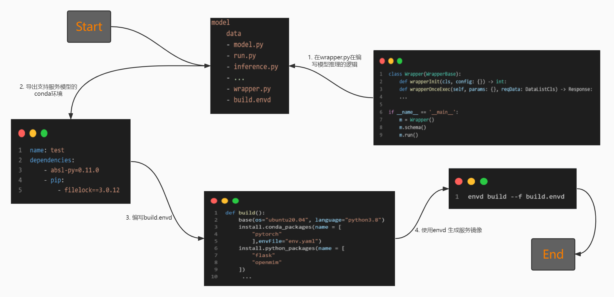

## 什么是Envd?
> 通过编写 Python 代码来负责 Docker 和开发环境的设置，因为开发环境充满了 Dockerfile、bash 脚本、Kubernetes YAML 清单以及许多其他总是会中断的笨重文件。envd构建是隔离和干净的。你可以用 Python 编写简单的指令，而不是 Bash / Makefile / Dockerfile / ...，并且envd提供可重复的构建和可重现的结果。

## 研究现状

1. 当前的研究环境存在conda的使用规范问题（一个环境支持多个模型进行推理和训练）以及研究环境到推理环境的依赖不对等问题（模型训练过程中需要的环境依赖，在推理过程中往往不全是必须的）。
2. 没有有效的辅助从研究环境到推理环境迁移的工具链,在迁移的过程中，往往需要开发人员自己去安装环境依赖,并对业务代码做出一定的修改，浪费了人力。

## 通过envd辅助业务流程构建

#### 需要的文件：
    - conda yaml环境配置文件
    - 编写的wrapper.py文件
    - 模型的代码文件
    - 业务的base镜像
    - 通过配置文件编写的build.envd文件

#### 服务构建流程图：   

  

#### base镜像的构建方案

- ubuntu + aiservice + cpu
- ubuntu + aiservice + gpu

## 通过envd实现服务环境迁移案例

#### 1、Requirements
- Docker (20.10.0 or above)

#### 2、envd 安装
```
pip install --pre --upgrade envd
envd bootstrap
```

#### 3、导出 Conda env.yaml示例

```
name: kyle
 
channels:
  - https://repo.anaconda.com/pkgs/main
  - https://mirrors.tuna.tsinghua.edu.cn/anaconda/pkgs/main/
  - https://mirrors.tuna.tsinghua.edu.cn/anaconda/pkgs/free/
  - https://mirrors.tuna.tsinghua.edu.cn/anaconda/cloud/pytorch/
  - https://mirrors.tuna.tsinghua.edu.cn/anaconda/cloud/menpo/
  - https://mirrors.tuna.tsinghua.edu.cn/anaconda/cloud/bioconda/
  - https://mirrors.tuna.tsinghua.edu.cn/anaconda/cloud/msys2/
  - https://mirrors.tuna.tsinghua.edu.cn/anaconda/cloud/conda-forge/
  - defaults
 
dependencies:
  - requests
  - pip:
    - opencv-python==4.1.2.30
 
prefix: C:\ProgramData\Anaconda3\envs\kyle
 
```

#### 4、编写build.envd示例
```
def build():
    mirror_config() 
    base(language="python3.8", os="ubuntu20.4")                          # 加载基础镜像并设置conda内置的python版本
    install.python_packages(name = [
        "torch==1.10",
        "openmim"
    ])
    install.conda_packages(channel= ["pytorch"], env_file = "env.yaml")   # 指定路径下进行conda yaml环境安装
    install.python_packages(requirements="build.txt")                     # 指定路径下进行requirments.txt安装
    install.system_packages(name = [                                      # 系统依赖安装
        "libgl1-mesa-glx"
    ])
    run(commands=[
        "mim install mmcv-full",                                           # 通过第三方工具mim来进行安装
    ])

    io.copy(src="./detectron2", dest="/")                                  # 本地文件到镜像的拷贝
    run(commands=[                                                         # 离线进行依赖包安装
        "pip install -e /detectron2",
    ])
def mirror_config():                                                       #下载源配置
    config.pip_index(url = "https://pypi.tuna.tsinghua.edu.cn/simple")
    config.conda_channel(channel="""
    channels:
    - defaults
    show_channel_urls: true
    default_channels:
    - https://repo.anaconda.com/pkgs/main
    - https://mirrors.tuna.tsinghua.edu.cn/anaconda/pkgs/main/
    - https://mirrors.tuna.tsinghua.edu.cn/anaconda/pkgs/free/
    - https://mirrors.tuna.tsinghua.edu.cn/anaconda/cloud/pytorch/
    - https://mirrors.tuna.tsinghua.edu.cn/anaconda/cloud/menpo/
    - https://mirrors.tuna.tsinghua.edu.cn/anaconda/cloud/bioconda/
    - https://mirrors.tuna.tsinghua.edu.cn/anaconda/cloud/msys2/
    - https://mirrors.tuna.tsinghua.edu.cn/anaconda/cloud/conda-forge/
    custom_channels:
    conda-forge: https://mirrors.tuna.tsinghua.edu.cn/anaconda/cloud
    msys2: https://mirrors.tuna.tsinghua.edu.cn/anaconda/cloud
    bioconda: https://mirrors.tuna.tsinghua.edu.cn/anaconda/cloud
    menpo: https://mirrors.tuna.tsinghua.edu.cn/anaconda/cloud
    pytorch: https://mirrors.tuna.tsinghua.edu.cn/anaconda/cloud
    pytorch-lts: https://mirrors.tuna.tsinghua.edu.cn/anaconda/cloud
    simpleitk: https://mirrors.tuna.tsinghua.edu.cn/anaconda/cloud
    """)
```

#### 5、通过envd构建镜像
```
envd build --t 镜像名:TAG
```