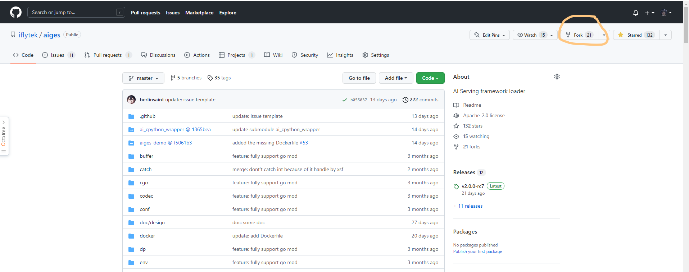
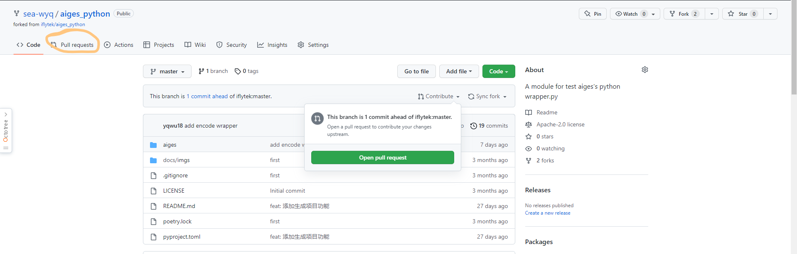
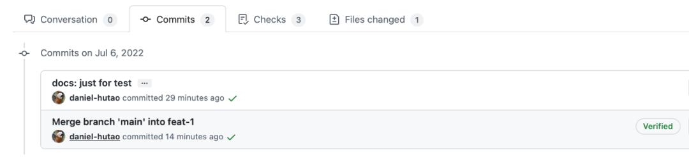

学完这篇文章，你将会学会如何参与开源项目

# 为什么要参与开源项目？
- 自己的代码被合并是一件有趣的事情。
- 在看开源项目的源码的过程中，会收益很多，编码的能力能够在上一个台阶。

# 为什么我想介绍如何PR？
在管理一个github项目的过程中三差五就会有新贡献者提交 PR 过来，但是多数贡献者在提交第一个 PR 时往往会遇到一个或多个问题，比如产生冲突、commits 记录过多或者混乱、commit 没有签名、commit message 不规范、各种 ci 流程检查报错等等。  

那么今天我想尝试彻底讲明白“如何正确地提交一个 PR”，尝试细说 GitHub 上的 PR 全过程，以及这里面可能会遇到的各种困难和解决办法。一方面希望对第一次参与开源项目的新人有所帮助，另一方面希望能够进一步降低我们项目的参与门槛。

# 我想参与开源项目，怎么开始？

### 寻找合适的开源项目
如果你就只是想开始参与开源，暂时还不知道该参与哪个社区，那么我有几个小建议：
- 不要从特别成熟的项目开始。比如现在去参与 Kubernetes 社区，一方面由于贡献者太多，很难抢到一个入门级的 issue 来开始第一个 PR；另外一方面也由于贡献者太多，你的声音会被淹没，社区维护者并不在意多你一个或者少你一个（当然可能没有人会承认，但是你不得不信），如果你提个 PR 都遇到了各种问题还不能自己独立解决，那么很可能你的 PR 会直接超时关闭，没有人在意你是不是有一个好的参与体验；
- 不要从特别小的项目开始。这就不需要我解释了吧？很早期的开源项目可能面临着非常多的问题，比如代码不规范、协作流程不规范、重构频繁且不是 issue 驱动的，让外部参与者无所适从……
- 选择知名开源软件基金会的孵化项目。这类项目一方面不是特别成熟，所以对新贡献者友好；另一方面也不会特别不成熟，不至于给人很差的参与体验，比如 Apache 基金会、Linux 基金会、CNCF 等。

### 寻找贡献点
开源项目的参与方式很多，最典型的方式是提交一个特性开发或者 bug 修复相关的 PR，但是其实文档完善、测试用例完善、bug 反馈等等也都是非常有价值的贡献。

- 在项目 GitHub 代码库首页都会有一个 Issues 入口，这里会记录项目目前已知的 bug、proposal（可以理解成新需求）、计划补充的文档、亟需完善的 UT 等等。
- 浏览一下这些issues，看下有没有你感兴趣的而且还没被分配的 issue，然后在下面留言，等待项目管理员分配任务后就可以开始编码了。

# 我要提交PR，怎么上手？

### 第一步：Fork 项目仓库
GitHub 上的项目都有一个 Fork 按钮，我们需要先将开源项目 fork 到自己的账号下，以aiges为例：

点一下 Fork 按钮，然后回到自己账号下，可以找到 fork 到的项目了：

这个项目在你自己的账号下，也就意味着你有任意修改的权限了。我们后面要做的事情，就是将代码变更提到自己 fork 出来的代码库里，然后再通过 Pull Request 的方式将 commits 合入上游项目。

### 第二步：克隆项目仓库到本地
```bash
git clone https://github.com/sea-wyq/aiges.git
cd aiges 
git remote add upstream https://github.com/iflytek/aiges.git
```
如果你配置好了 ssh 方式来 clone 代码，当然，git clone 命令用的 url 可以改成：git@github.com:iflytek/aiges.git。

完成这一步后，我们在本地看到的 remote 信息应该是这样的：
```bash
git remote -v
```

```bash
origin https://github.com/sea-wyq/aiges.git (fetch)
origin https://github.com/sea-wyq/aiges.git (push)
upstream https://github.com/iflytek/aiges.git (fetch)
upstream https://github.com/iflytek/aiges.git (push)
```
记住啰，你本地的代码变更永远只提交到 origin，然后通过 origin 提交 Pull Request 到 upstream。

### 第三步：更新本地分支代码

如果你刚刚完成 fork 和 clone 操作，那么你本地的代码肯定是新的。但是“刚刚”只存在一次，接着每一次准备开始写代码之前，你都需要确认本地分支的代码是新的，因为基于老代码开发你会陷入无限的冲突困境之中。

更新本地 main 分支代码：
```
git fetch upstream
git checkout main
git rebase upstream/main
```
当然，我不建议你直接在 main 分支写代码，虽然你的第一个 PR 从 main 提交完全没有问题，但是如果你需要同时提交 2 个 PR 呢？总之鼓励新增一个 feat-xxx 或者 fix-xxx 等更可读的分支来完成开发工作。

创建分支：

```bash
git checkout -b feat-xxx
```
这样，我们就得到了一个和上游 main 分支代码一样的特性分支 feat-xxx 了，接着可以开始愉快地写代码啦！

### 第四步：写代码

没啥好说的，写就是了，写！

### 第五步：Commit 和 Push

通用的流程：
```bash
git add <file>
git commit -s -m "some description here"
git push origin branchName
```
当然，这里大家需要理解这几个命令和参数的含义，灵活调整。比如你也可以用 git add --all 完成 add 步骤，在 push 的时候也可以加 -f 参数，用来强制覆盖远程分支（假如已经存在，但是 commits 记录不合你意）。但是请记得 git commit 的 -s 参数一定要加哦！

这里要注意 commit message 的规范，可能每个开源项目的要求不尽相同，比如 DevStream 的规范[6]是类似这样的格式：
```bash
<type>[optional scope]: <description>
[optional body]
[optional footer(s)]
```
举几个例子：
- feat: some description here
- docs: some description here
- fix: some description here
- fix(core): some description here
- chore: some description here
- ……

### 第六步：开一个 PR
在完成 push 操作后，我们打开 GitHub，可以看到显示一个超前提交信息，告诉我们可以开一个 Pull Request 了：


点击Pull Request 格式默认是这样的：


这里我们需要填写一个合适的标题（默认和 commit message 一样），然后按照模板填写 PR 描述。PR 模板其实在每个开源项目里都不太一样，我们需要仔细阅读上面的内容，避免犯低级错误。

填写完毕后，然后点击右下角 “Create pull request” 就完成了一个 PR 的创建了。

提交了 PR 之后，我们就可以在 PR 列表里找到自己的 PR 了，这时候还需要注意 ci 检查是不是全部能够通过，假如失败了，需要及时修复。


### 第七步：PR 合入
如果你的 PR 很完美，毫无争议，那么过不了太长时间，项目管理员会直接合入你的 PR，那么你这个 PR 的生命周期也就到此结束了。

但是，没错，这里有个“但是”，但是往往第一次 PR 不会那么顺利，我们接下来就详细介绍一下可能经常遇到的一些问题和对应的解决办法。

# 我提交了一个 PR，然后遇到了其他问题

多数情况下，提交一个 PR 后是不会被马上合入的，reviewers 可能会提出各种修改意见，或者我们的 PR 本身存在一些规范性问题，或者 ci 检查就直接报错了，怎么解决呢？继续往下看吧。

### Reviewers 提了一些修改意见，我如何更新 PR？

很多时候，我们提交了一个 PR 后，还需要继续追加 commit，比如提交后发现代码还有点问题，想再改改，或者 reviewers 提了一些修改意见，我们需要更新代码。

一般我们遵守一个约定：在 review 开始之前，更新代码尽量不引入新的 commits 记录，也就是能合并就合并，保证 commits 记录清晰且有意义；在 review 开始之后，针对 reviewers 的修改意见所产生的新 commit，可以不向前合并，这样能够让二次 review 工作更有针对性。

不过不同社区要求不一样，可能有的开源项目会要求一个 PR 里只能包含一个 commit，大家根据实际场景灵活判断即可。

说回如何更新 PR，我们只需要在本地继续修改代码，然后通过和第一个 commit 一样的步骤，执行这几个命令：
```bash
git add <file>
git commit -s -m "some description here"
git push origin feat-xxx
```
这时候别看 push 的是 origin 的 feat-xxx 分支，其实 GitHub 会帮你把新增的 commits 全部追加到一个未合入 PR 里去。没错，你只管不断 push，PR 会自动更新。

至于如何合并 commits，我们下一小节具体介绍。

### Commits 太多或者记录混乱，如何合并 Commits？

很多情况下我们需要去合并 commits，比如你的第一个 commit 里改了100 行代码，然后发现少改了 1 行，这时候又提交了一个 commit，那么第二个 commit 就太“没意思”了，我们需要合并一下。
比如我这里有2个同名的 commits，第二个 commit 其实只改了一个标点：

这时候我们可以通过 rebase 命令来完成2个 commits 的合并：
```bash
git rebase -i HEAD~2
```
执行这个命令会进入一个编辑页面，默认是 vim 编辑模式，内容大致如下：
```bash
pick 3114c0f docs: just fortest
pick 9b7d63b docs: just fortest

# Rebase d640931..9b7d63b onto d640931 (2 commands)
#
# Commands:
# p, pick = use commit
# r, reword = use commit, but edit the commit message
# e, edit = use commit, but stop for amending
# s, squash = use commit, but meld into previous commit
# f, fixup = like "squash", but discard this commit's log message
# x, exec = run command (the rest of the line) using shell
# d, drop = remove commit
#
# These lines can be re-ordered; they are executed from top to bottom.
#
# If you remove a line here THAT COMMIT WILL BE LOST.
#
# However, if you remove everything, the rebase will be aborted.
```
我们需要把第二个 pick 改成 s，然后保存退出（vim 的 wq 命令）：
```
pick 3114c0f docs: just fortest
s 9b7d63b docs: just fortest
```
接着会进入第二个编辑页面：
```bash
# This is a combination of 2 commits.
# This is the 1st commit message:

docs: just fortest

Signed-off-by: Daniel Hu <tao.hu@merico.dev>

# This is the commit message #2:

docs: just fortest

Signed-off-by: Daniel Hu <tao.hu@merico.dev>

# Please enter the commit message for your changes. Lines starting
# with '#' will be ignored, and an empty message aborts the commit.
# ...
```
这里是用来编辑合并后的 commit message 的，我们直接删掉多余部分，只保留这样几行：
```bash
docs: just fortest

Signed-off-by: Daniel Hu <tao.hu@merico.dev>
```
接着同样是 vim 的保存退出操作，这时候可以看到日志：
```bash
[detached HEAD 80f5e57] docs: just fortest
 Date: Wed Jul 6 10:28:37 2022 +0800
 1 file changed, 2 insertions(+)
Successfully rebased and updated refs/heads/feat-1.
```
这时候可以通过git log命令查看下 commits 记录是不是符合预期：


好，我们在本地确认 commits 已经完成合并，这时候就可以继续推送到远程，让 PR 也更新掉：
```bash
git push -f origin feat-xxx
```
这里需要有一个-f参数来强制更新，合并了 commits 本质也是一种冲突，需要冲掉远程旧的 commits 记录。

### PR 产生了冲突，如何解决？

#### 在线解决冲突
我们要尽可能避免冲突，养成每次写代码前更新本地代码的习惯。不过，冲突不可能完全避免，有时候你的 PR 被阻塞了几天，可能别人改了同一行代码，还抢先被合入了，这时候你的 PR 就出现冲突了，类似这样（同样，此刻我不能真的去上游项目构造冲突，所以下面用于演示的冲突在我在自己的 repo 里）：

每次看到这个页面都会让人觉得心头一紧。我们点击 “Resolve conflicts” 按钮，就可以看到具体冲突的内容了：

可以看到具体冲突的行了，接下来要做的就是解决冲突。我们需要删掉所有的 <<<<<<<、>>>>>>> 和 ======= 标记，只保留最终想要的内容，如下：

接着点击右上角的“Mark as Resolved”：

最后点击“Commit merge”：

这样就完成冲突解决了，可以看到产生了一个新的 commit：

到这里，冲突就解决掉了。

#### 本地解决冲突

更多时候，我们需要在本地解决冲突，尤其是冲突太多，太复杂的时候。

同样，我们构造一个冲突，这次尝试在本地解决冲突。

先在线看一下冲突的内容：


接着我们在本地执行：
```bash
# 先切回到 main 分支
git checkout main
# 拉取上游代码（实际场景肯定是和上游冲突，我们这里的演示环境其实是 origin）
git fetch upstream
# 更新本地 main（这里也可以用 rebase，但是 reset 不管有没有冲突总是会成功）
git reset --hard upstream/main
```

到这里，本地 main 分支就和远程（或者上游）main 分支代码完全一致了，然后我们要做的是将 main 分支的代码合入自己的特性分支，同时解决冲突。
```bash
git checkout feat-1
git rebase main
```
这时候会看到这样的日志：
```bash
First, rewinding head to replay your work on top of it...
Applying: docs: conflict test 1
Using index info to reconstruct a base tree...
M       README.md
Falling back to patching base and 3-way merge...
Auto-merging README.md
CONFLICT (content): Merge conflict in README.md
error: Failed to merge in the changes.
Patch failed at 0001 docs: conflict test 1
The copy of the patch that failed is found in: .git/rebase-apply/patch

Resolve all conflicts manually, mark them as resolved with
"git add/rm <conflicted_files>", then run "git rebase --continue".
You can instead skip this commit: run "git rebase --skip".
To abort and get back to the state before "git rebase", run "git rebase --abort".
```

我们需要解决冲突，直接打开 README.md，找到冲突的地方，直接修改。这里的改法和上一小节介绍的在线解决冲突没有任何区别，我就不赘述了。

```bash
git push -f origin feat-xxx
```

这时候我们再回到 GitHub 看 PR 的话，可以发现冲突已经解决了，并且没有产生多余的 commit 记录，也就是说这个 PR 的 commit 记录非常干净，好似冲突从来没有出现过：

至于什么时候可以在线解决冲突，什么时候适合本地解决冲突，就看大家如何看待“需不需要保留解决冲突的记录”了，不同社区的理解不一样，可能特别成熟的开源社区会希望使用本地解决冲突方式，因为在线解决冲突产生的这条 merge 记录其实“没营养”。至于 DevStream 社区和 DevLake 社区，我们推荐使用后一种，但是不做强制要求。

#### CI 检查不过：commit message 相关问题如何修复？

前面我们提到过 commit message 的规范，但是第一次提交 PR 的时候还是很容易出错，比如 feat: xxx 其实能通过 ci 检查，但是 feat: Xxx 就不行了。假设现在我们不小心提交了一个 PR，但是里面 commit 的 message 不规范，这时候怎么修改呢？

太简单了，直接执行：
```bash
git commit --amend
```
这条命令执行后就能进入编辑页面，随意更新 commit message 了。改完之后，继续 push：
```bash
git push -f origin feat-xxx
```
这样就能更新 PR 里的 commit message 了。

#### CI 检查不过：DCO(sign) 问题如何修复？

相当多的开源项目会要求所有合入的 commits 都包含一行类似这样的记录：
```bash
Daniel Hu <tao.hu@merico.dev>
```
所以 commit message 看起来会像这样：
```bash
feat: some description here
    
Signed-off-by: Daniel Hu <tao.hu@merico.dev>
```
这行信息相当于是对应 commit 的作者签名。要添加这样一行签名当然很简单，我们直接在 git commit 命令后面加一个 -s 参数就可以了，比如 git commit -s -m "some description here" 提交的 commit 就会带上你的签名。

但是如果如果你第一次提交的 PR 里忘记了在 commits 中添加 Signed-off-by 呢？这时候，如果对应开源项目配置了 DCO 检查[8]，那么你的 PR 就会在 ci 检查中被“揪出来”没有正确签名。

我们看下如何解决：
```bash
git commit --amend -s
```
这样一个简单的命令，就能直接在最近一个 commit 里加上 Signed-off-by 信息。执行这行命令后会直接进入 commit message 编辑页面，默认如下图：
```bash
docs: dco test

Signed-off-by: Daniel Hu <tao.hu@merico.dev
```

这时候我们可以同时修改 commit message，如果不需要，那就直接保存退出好了，签名信息是会自动加上的。

完成签名后呢？当然是来一个强制 push 了：
```
git push -f origin feat-xxx
```
这样，你 PR 中的 DCO 报错就自然修复了。

本文引用自：https://mp.weixin.qq.com/s/sP2dC0txvBhExYxbjq94UA