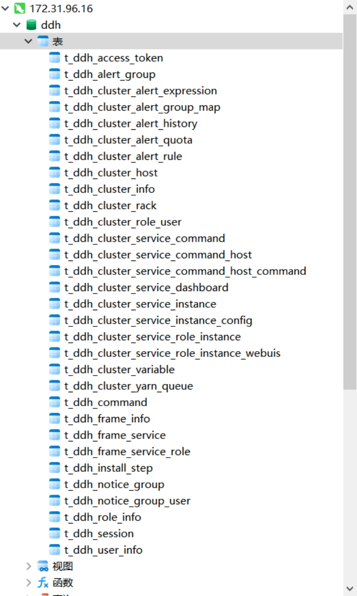
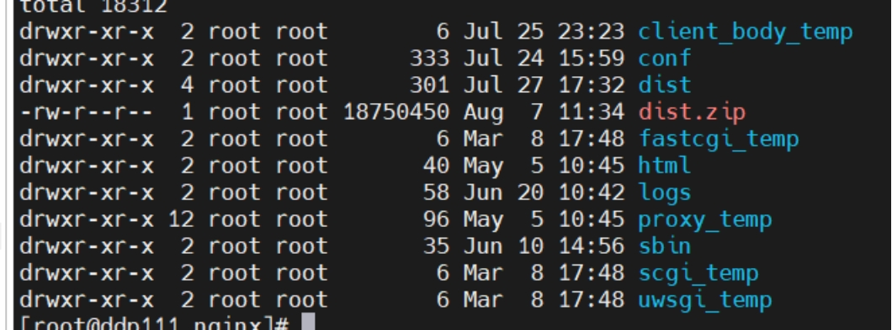

## 1.1 部署mysql（略）

注意需关闭mysql ssl功能。在部署过程中，部分组件会执行sql生成库表，不同环境的mysql在配置上存在差异，可根据sql执行情况，变更mysql配置。mysql建议版本为5.7.X。

## 1.2 部署nginx

提供nginx.conf 的server配置。

```
         server {
                listen 8888;# 访问端口(自行修改)
                server_name localhost;
                #charset koi8-r;
                #access_log /var/log/nginx/host.access.log main;
                location / {
                        root /usr/local/nginx/dist; # 前端解压的 dist 目录地址(自行修改)
                        index index.html index.html;
                }
                location /ddh {
                        proxy_pass http://ddp1:8081; # 接口地址(自行修改)
                        proxy_set_header Host $host;
                        proxy_set_header X-Real-IP $remote_addr;
                        proxy_set_header x_real_ipP $remote_addr;
                        proxy_set_header remote_addr $remote_addr;
                        proxy_set_header X-Forwarded-For $proxy_add_x_forwarded_for;
                        proxy_http_version 1.1;
                        proxy_connect_timeout 4s;
                        proxy_read_timeout 30s;
                        proxy_send_timeout 12s;
                        proxy_set_header Upgrade $http_upgrade;
                        proxy_set_header Connection "upgrade";
                }

                #error_page 404 /404.html;
                # redirect server error pages to the static page /50x.html
                #
                error_page 500 502 503 504 /50x.html;
                location = /50x.html {
                        root /usr/share/nginx/html;
                }
        }

```


## 1.3 执行数据脚本

创建ddh数据库并赋权。

```
CREATE DATABASE IF NOT EXISTS ddh DEFAULT CHARACTER SET utf8;
grant all privileges on *.* to ddh@"%" identified by 'ddh' with grant option;
GRANT ALL PRIVILEGES ON *.* TO 'ddh'@'%';
FLUSH PRIVILEGES;
```

登录mysql，执行数据库脚本ddh.sql，执行成功后可以看到如下数据库及表。

 

## 1.4 解压DDP.tar.gz

在/opt/datasophon目录下解压DDP.tar.gz。

## 1.5 修改配置

### 1.5.1 部署目录介绍

在安装目录下解压ddh.tar.gz，解压后可以看到如下安装目录：

 

bin：启动脚本

conf ：配置文件

lib ：项目依赖的jar包

logs:项目日志存放目录

jmx：jmx插件

### 1.5.2 修改配置文件

修改 conf 目录下的application.yml 配置文件中数据库链接配置：

```
# Tomcat
server:
  port: 8081
  servlet:
    context-path: /ddh/
security:
  authentication:
    type: PASSWORD
# mysql
spring:
  datasource:
    type: com.alibaba.druid.pool.DruidDataSource
    url: jdbc:mysql://ddp1:3306/ddh?useUnicode=true&characterEncoding=utf-8
    username: root
    password: datasophon
    driver-class-name: com.mysql.jdbc.Driver
#json格式化全局配置
  jackson:
    time-zone: GMT+8
    date-format: yyyy-MM-dd HH:mm:ss
  mvc:
    date-format: yyyy-MM-dd HH:mm:ss

#mybatis
mybatis-plus:
  mapper-locations: classpath*:/mapper/*.xml
  #实体扫描，多个package用逗号或者分号分隔
  typeAliasesPackage: com.datasophon.ddh.dao.entity
  typeEnumsPackage: com.datasophon.ddh.dao.enums
  global-config:
    #数据库相关配置
    db-config:
      #主键类型  AUTO:"数据库ID自增", INPUT:"用户输入ID", ID_WORKER:"全局唯一ID (数字类型唯一ID)", UUID:"全局唯一ID UUID";
      id-type: AUTO
      #字段策略 IGNORED:"忽略判断",NOT_NULL:"非 NULL 判断"),NOT_EMPTY:"非空判断"
      field-strategy: NOT_NULL
      #驼峰下划线转换
      column-underline: true
      logic-delete-value: -1
      logic-not-delete-value: 0
    banner: false
  #原生配置
  configuration:
    map-underscore-to-camel-case: true
    cache-enabled: false
    call-setters-on-nulls: true
    jdbc-type-for-null: 'null'
#    log-impl: org.apache.ibatis.logging.stdout.StdOutImpl
```


## 1.6 启动服务

在ddh目录下使用脚本启动服务

```
启动：sh bin/ddh-api.sh start api
停止：sh bin/ddh-api.sh stop api
重启：sh bin/ddh-api.sh restart api
```

部署成功后，可以进行日志查看，日志统一存放于logs文件夹内:

 logs/

  ├── ddh-api.log

  ├── ddh-api-error.log

  |—— api-{hostname}.out

## 1.7 部署前端

将dist.zip解压到nginx目录下，启动nginx。

 

## 1.8 访问页面

打开http://ddp1:8888访问页面