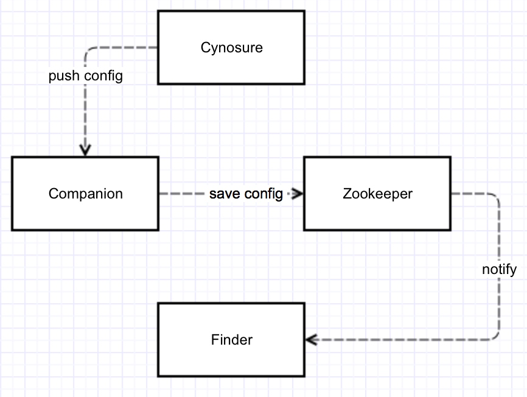
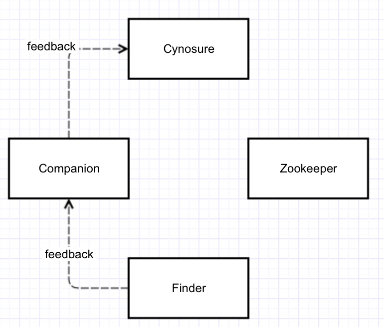

# Introduce


## Core functions
- Dynamic Config
- Service Registration, Service Discovery

## Features
- Full category for managing service
- Support multiple versions of service configuration
- Support configuration rollback
- Support feedback for pushing config
- Support online management of Provider/Consumer
- High availability
- Quick integration
- Support Docker/k8s deployment

## Architecture


## core module
- **Cynosure**

	This module is used to manage some basic data and configuration, and provides a visual configuration center operation page.

	You can use it to create Region, cluster information, service configuration, etc.
  
	


	

- **Finder(SDK with go/java/c++)**

	Client SDK, used for client side integrated configuration center and service discovery

- **Companion**

	This module is used to manipulate components that interact with zookeeper.
  
	**Case #1: Service Discovery**

	

	**Case #2: Configuration Push**

	

	**Case #3 Feedback?**

	


## How to Cite **Polaris** in Your Project

- **Install**

  `You can get from `[install.md](install.md)


- **SDK**[supported]

  `Beginning it with the Finder SDK as you know, here are some examples in golang. More detail code has uploaded and you can view from `[finder-go/example/demo.go](http://git.xfyun.cn/AIaaS/finder-go/src/master/example/demo.go)

```go
    package main
    import (
	       "encoding/json"
	       "finder-go"
	       "finder-go/common"
	       "finder-go/utils/httputil"
	       "fmt"
	       "net"
	       "net/http"
	       "os"
	       "time"
    )    
    func main() {
       cachePath, err := os.Getwd()
	   if err != nil {
		  return
       }        
        
	   cachePath += "/findercache"
	   config := common.BootConfig{
		  CompanionUrl:     "http://    10.1.86.223:9080",
		  CachePath:        cachePath,
		  TickerDuration:   5000,
		  ZkSessionTimeout: 1000 * time.Second,
		  ZkConnectTimeout: 300 * time.Second,
		  ZkMaxSleepTime:   15 * time.Second,
		  ZkMaxRetryNum:    3,
		  MeteData: &common.ServiceMeteData{
			 Project: "test",
			 Group:   "default",
			 Service: "xsf",
			 Version: "1.0.0",
			 Address: "192.168.1.2:9091",
		  },
	   }	
       
	   f, err := finder.NewFinder(config)
	   if err != nil {
		  fmt.Println(err)
	   }	   
       
	   // use config with watcher
	   handler := new(ConfigChangedHandle)
	   configFiles, err := f.ConfigFinder.UseAndSubscribeConfig([]string{"default.cfg", "xsfc.tmol"}, handler)	   
       
	   // register service 
	   err = f.ServiceFinder.RegisterService()
	   if err != nil {
		  fmt.Println(err)
	   } 	   
       
	   // describe service
	   handler := new(ServiceChangedHandle)
	   serviceList, err = f.ServiceFinder.UseAndSubscribeService([]string{"xsf"}, handler)
	   if err != nil {
		  fmt.Println(err)
	   }	   
       
	   //todo business...
    }
```

- **Agent**[planning]

  `Also,you can have an integration with our agent without coding. This is in the planning stage already.`


