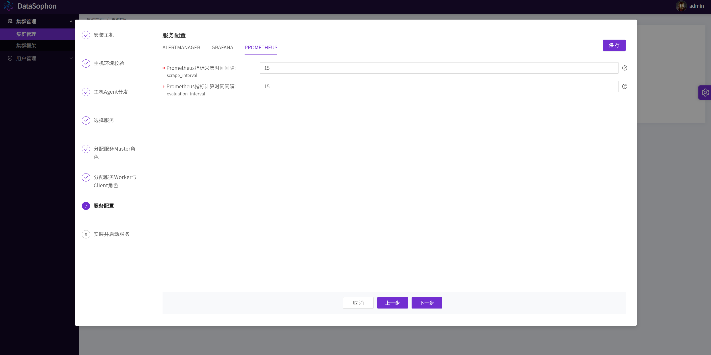
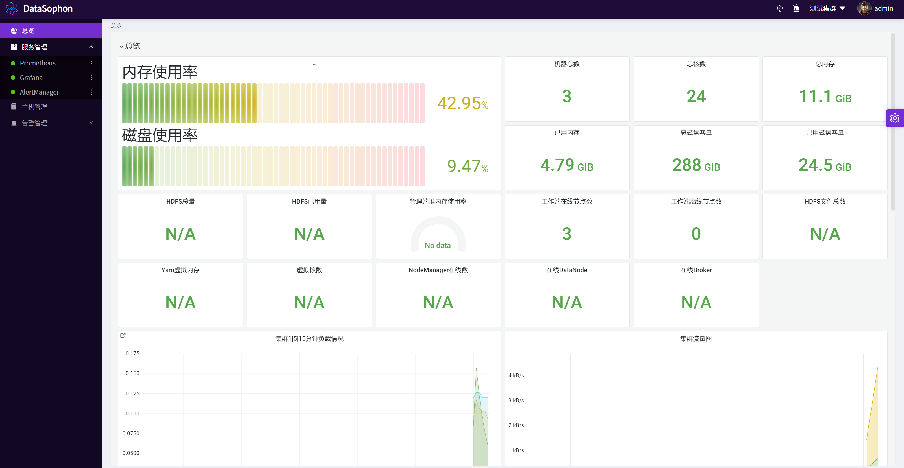

# 创建集群

登录进入系统页面后在集群管理页面创建集群，DataSophon支持多集群管理和授予用户集群管理员权限。

点击【创建集群】，输入集群名称，集群编码（集群唯一标识），集群框架。

创建成功后点击【配置集群】：

根据提示，输入主机列表，ssh用户名默认为root和ssh端口默认为22。

配置完成后，点击【下一步】，系统开始链接主机并进行主机环境校验。

主机环境校验成功后点击【下一步】，主机agent分发步骤将自动分发datasophon-worker组件，并启动WorkerApplicationServer。

主机管理Agent分发完成后，点击【下一步】，开始部署服务。

初始化配置集群先选择部署AlertManager,Grafana和Prometheus三个组件。DataSophon依赖此三个组件实现系统监控告警管理。

点击【下一步】，分配AlertManager,Grafana和Prometheus服务的master服务角色部署节点，此三个组件需部署在同一台机器上。

点击【下一步】，分配AlertManager,Grafana和Prometheus服务的worker与client服务角色部署节点，没有worker和client服务角色的可以跳过之间点击【下一步】。

修改各服务配置。系统已给出默认配置，大部分情况下无需修改。

点击【下一步】开始服务安装，可实时查看服务安装进度。

点击【完成】，在集群管理页面点击【进入】，即可进入集群服务组件管理页面。

