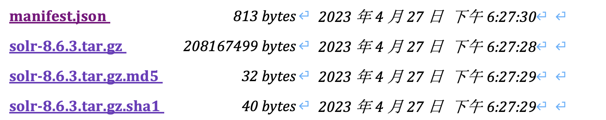
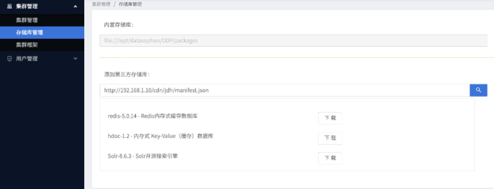
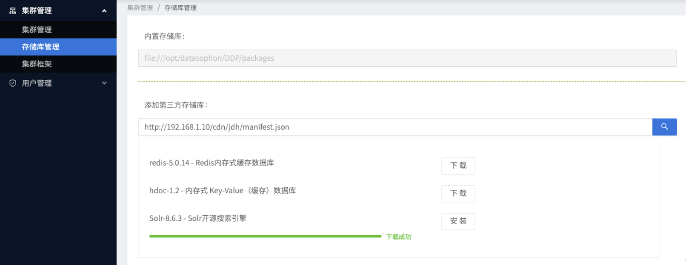
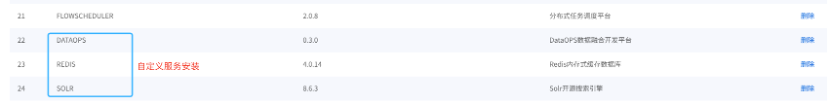

# 存储库管理

DDP 目前都是将组件存放在 /opt/datasophon/packages/DDP 目录下，同时在 api-manager 下有框架脚本 conf/meta/DDP-1.0.0. 将安装的配置信息采用 freemarker 模版生成，模版存放在 worker/conf/templates。

这对第三方自定义集成略有不友好，需要手动放置上述文件，并且无法在线管理。综合借鉴 CDH 的存储库 parcel，设计 DDH 支持在线的第三方组件安装。

## 存储库设计

存储库是一个远程文件服务器地址，支持从页面添加到 DDH。参考 CDH parcel 规范，一个存储库应包含一个或多个 parcel （parcel 实际上是 tar.gz的压缩包）文件，和一个 manifest.json。manifest 用于描述和校验 parcel 的合法性。

```json
{
    "lastUpdated": 1682591248909,
    "parcel": {
        "parcelName": "datasophon.com-DDP",
        "hash": "13c6c02e41fa020ec3d526ab4b72f08174b444a5",
        "md5": "13c6c02e41fa020ec3d526ab4b72f08174b444a5",
        "depends": "DDP (>1.0). DDP (<<2.0)",
        "meta": "DDP-1.0.0",
        "components": [
            {
                "name": "ELASTICSEARCH",
                "label": "ElasticSearch",
                "version": "6.8.18",
                "packageName": "elasticsearch-7.16.2.tar.gz",
                "hash": "13c6c02e41fa020ec3d526ab4b72f08174b444a5",
                "description": "高性能搜索引擎"
            },
            {
                "name": "REDIS",
                "label": "Redis",
                "version": "4.1.12",
                "packageName": "redis-4.1.12.tar.gz",
                "hash": "13c6c02e41fa020ec3d526ab4b72f08174b444a5",
                "description": "内存式 Key-Value（缓存）数据库"
            }
        ]
    }
}
```

在 components 内，是该存储库中可选的服务安装包。服务的安装包应和manifest 在相同目录。每个安装包应是 tar.gz 的格式，同时应存在 md5 和 sha1 格式的同名称的校验文件。将文件服务器 manifest.json 的文件地址填入到第三方存储库中，即可加载到远程的安装包。一个 parcel 远程库可包含多个组件，在 minifest.json 内 components 中定义即可。如在上述 parcel 站点中包含了如下两个组件：

redis-4.1.12.tar.gz
elasticsearch-7.16.2.tar.gz

每个组件 tar.gz 中, 应包含：

1. META 信息，如 DDH 中的 meta，应包含一个 service_ddl.json 和 control.sh。 用于组件启动、停止；
2. templates 信息，在 DDH 安装时可按照约定生成配置文件；

内容如下：

``` python
redis-4.1.12
|-- meta
    |-- service_ddl.json
|-- templates
    |-- redis.config.ftl
|-- bin # redis二进制执行文件
|-- control_redis.sh  #服务启动和停止脚本
|-- conf # redis 配置文件
|-- logs # redis 运行日志目录
|-- 。。。 其他 redis 运行必须的文件
```

1. service_ddl.json DDP 服务定义控制文件；
2. control_redis.sh 服务组件的启动脚本（脚本文件名称在service_ddl.json中有指定），应支持 start、stop、status、restart 4个参数；
3. templates 内是服务生成配置文件的 freemarker 文件；
4. 其他文件时服务组件所需要的文件；

**注意：**
control_redis.sh 的 start、stop、status、restart 动作，成功应返回0，失败则返回 1。 如检测服务状态（status）时，服务运行正常则返回 0，服务停止或未运行则返回1；

## 存储库安装

上述组件文件，采用任意文件系统，制作一个文件服务器站点（可采用 nginx），我这里采用的 jetty。



远程添加一个存储的步骤：

1. 制作一个远程文件服务器站点，在站点的末端资源文件为 manifest.json，在 manifest.json 的同目录下应该包含一个或多个组件（如上是 solr 的组件）；
2. 将可访问的 URL （带 manifest.json） 填入存储库管理中的第三方存储库；
3. 下载(此时下载到 tmp 目录)后解压，校验 manifest.json 的 hash 是否和下载的一致。否则可认为是非法，拒绝安装；
4. 组件合法，在下载后展示 parcel 中的安装组件（如 Redis），并在随后显示安装按钮；
5. 询问确认安装，安装分为几个步骤：推送、校验、安装。安装后组件会下载到 /opt/datasophon/packages/DDP；
6. 安装的组件，组件会安装到『集群框架』中，然后可在集群内安装此组件；



加载的远程的服务安装包，需经过：下载、校验、安装 三个步骤即可加入到框架。此时 META 的框架中则多一条组件安装选项；



此时：从远程安装的组件和内置的组件有相同的添加逻辑。同时在不需要部分组件时，可直接删除（删除后不能恢复）。



