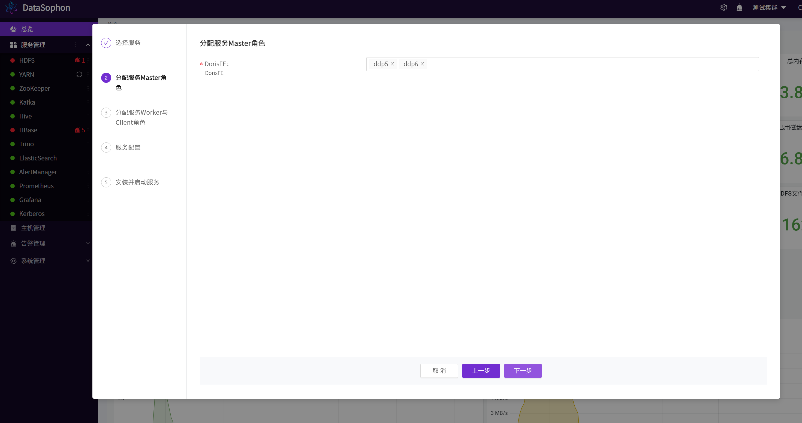
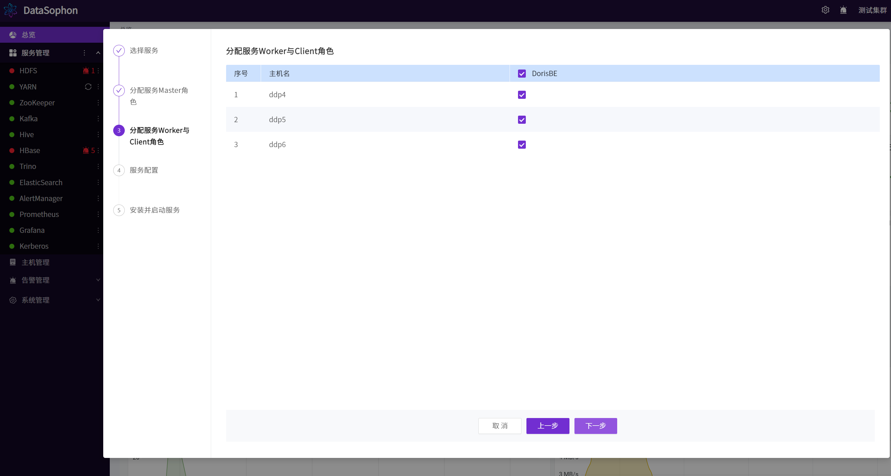

# 添加Doris

点击【添加服务】，选择Doris。

分配FE服务角色部署节点。

分配BE服务角色部署节点。

根据需要修改Doris配置，**其中FE优先网段和BE优先网段需要配置，如配置成172.31.86.0/24。**具体如何配置可查看Doris官网。

https://doris.apache.org/zh-CN/docs/install/install-deploy

点击【下一步】，开始安装Doris。

安装成功后可查看Doris服务总览页面。

