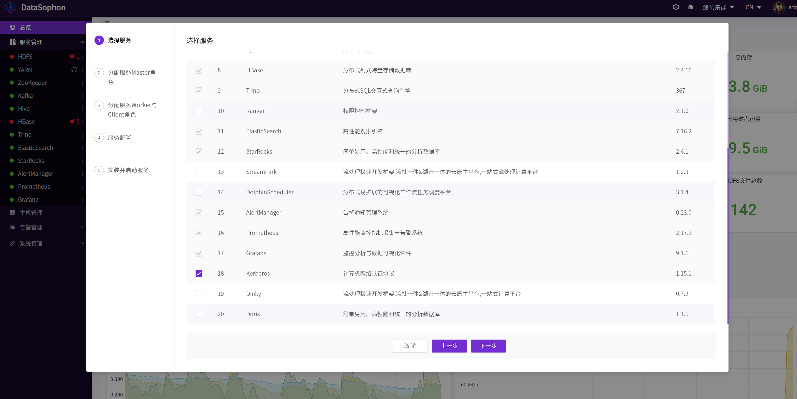
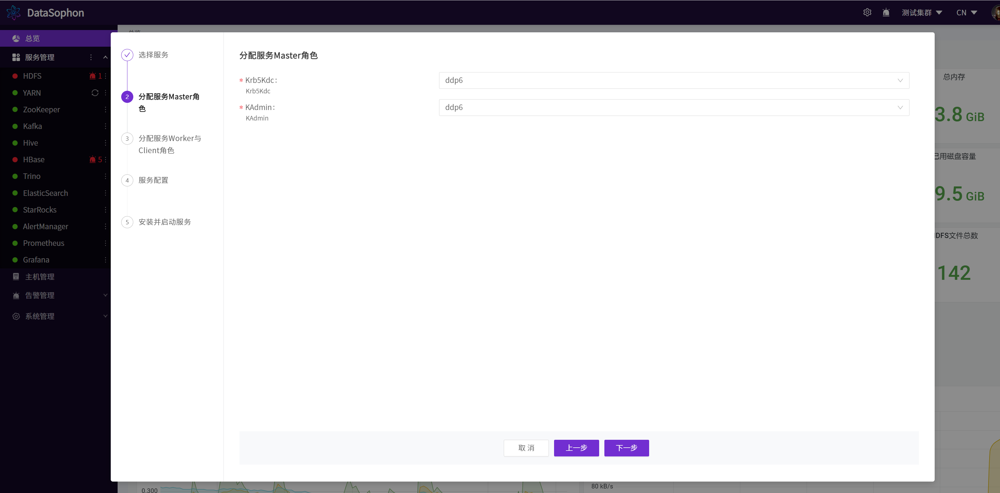
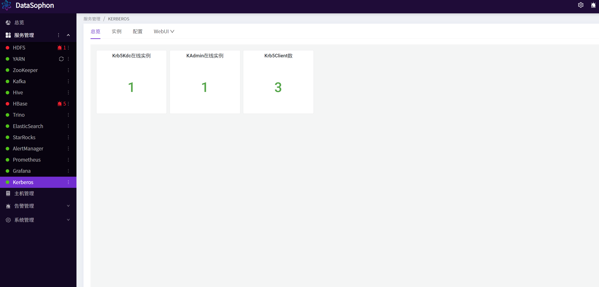

# 添加Kerberos

点击【添加服务】，选择Kerberos。

分配Krb5Kdc和KAdmin服务角色部署节点。

选择需要部署Krb5Client服务角色的节点。

点击【下一步】，进行Kerberos服务配置页面，默认不需要修改，注意：**域名默认为HADOOP.COM，暂不支持修改。**

点击【下一步】进行Kerbeross服务安装。**注意：Kerberos服务将通过yum方式安装，请保证各服务器上yum源可正常使用。**

