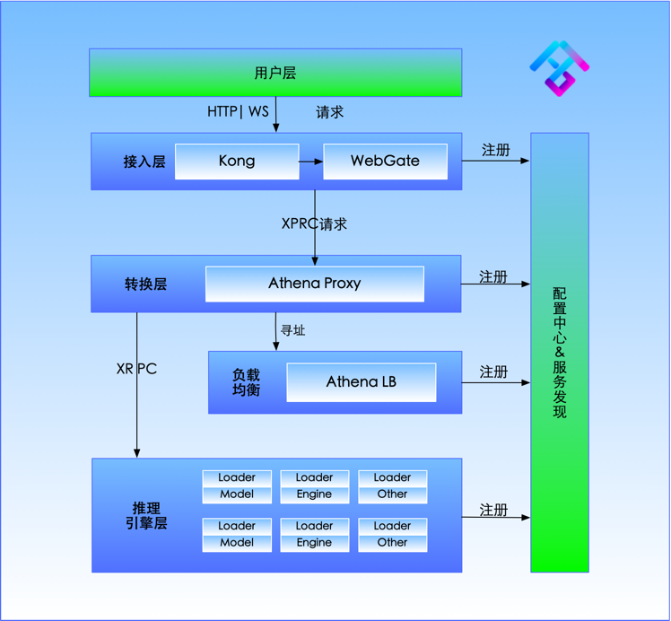

# AthenaServing Framework (ASF)

## Vision
In the whole field, AI capabilities can be rapidly implemented in production applications, and AI models and services can be reached at your fingertips; let ASF become the de facto standard of AI inference service framework.

## What is ASF?
It is a service-free, fully managed A.I. engine service framework designed for A.I. algorithm engineers. Algorithm engineers can quickly realize A.I. engine cloud service by integrating the Language Wrapper provided in ASF, without paying attention to the development and operation and maintenance of the underlying infrastructure and service, and can deploy the engine efficiently, safely, autonomously and controllably. Upgrade, scale, monitor and operate.

Relying on test's many years of experience in the production of voice technology as a service, a set of K8S-based service-oriented frameworks focusing on AI engineering and general AI capabilities. It is planned to expand a set of capabilities for managing AI services to k8s based on the service discovery mechanism and CRD mechanism of k8s.

The main features are:

* Model post-processing
* Model inference service
* Model service containerization
* Model service governance (service discovery, scaling)
* Model service dynamic load balancing
* Model service one-click deployment of private cloud
* Model service one-click deployment of public cloud ASE
* Model service protocol standardization

## What is AIGES ?

AIGES is one of the core components of ASF, implemented by golang. It provides a unified standard Wrapper interface for user-mode inference code, currently supports Python/C++, and theoretically supports any language plugin (not yet supported)

## Scenario-oriented
The implementation of AI service capabilities by SMEs lacks unified management and implementation plans. Every time a user adds a new AI capability, he needs to go through steps such as encapsulating an engine. Because the encapsulation engine does not have a unified standard and the business logic is complex, it is not easy for users to maintain and refactor.

## Solve the problem
1: The landing process of the research side model is too long and it is not easy to iterate
2: There is no unified standard for AI engine side packaging

## Overall Architecture (v2)

<!--  -->

## Workflow

### Features

&#9745; Support model inference into RPC service (Serving framework will be converted into HTTP service)

&#9745; Support c++/c code infer

&#9745; Support python code infer

&#9745; Support configuration center, service discovery

&#9745; Support three-party API forwarding

## Framework code repository

| Modules | Repository | Status |
|-----|-----|-----|
|&#9745; loader| [loader](https://github.com/xfyun/aiges)|Open source|
|&#9745; lb_client|[Load Balancer](https://github.com/xfyun/lb_client) Load aggregation component|Open source|
|&#9745; WebGate|[WebGate](https://github.com/xfyun/webgate) Web gateway component|Open source|
|&#9745; Atom|[Atom](https://github.com/xfyun/atoms) Protocol conversion component|Open source|
|&#9745; Polaris|[Polaris](https://github.com/xfyun/polaris) Configuration Center and Service Discovery|Open Source|
|&#9745; Helm|[athena_deploy]https://github.com/xfyun/athena_deploy |Open source|
|&#9744; Docker Compose| Serving on Docker with docker-compose one-click deployment|To be supported|
|&#9744; Documentation|[website](https://github.com/xfyun/test.github.io)|In Progress|
|&#9745; Protocol | [AI Capability Protocol Specification](https://github.com/xfyun/ase_protocol)|Open source|
|&#9744; AseCTl command line tool| [Asectl](#Asectl) command line tool|To be open source|
|&#9744; Python Debugging Toolkit| [AigesKit](https://github.com/xfyun/aiges_python)python toolkit|In progress|

