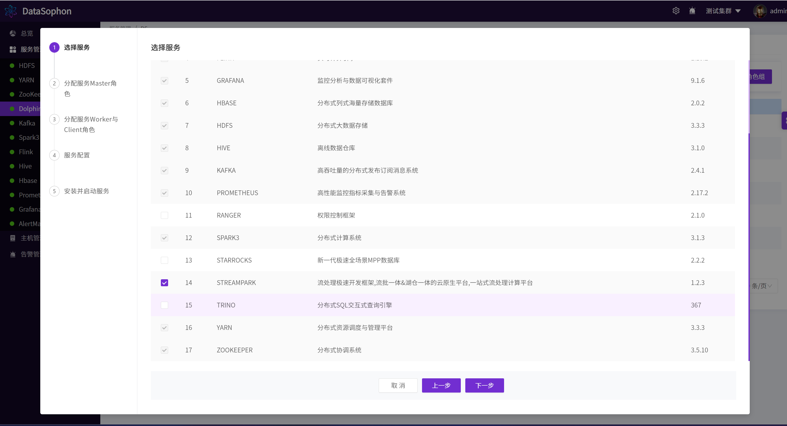
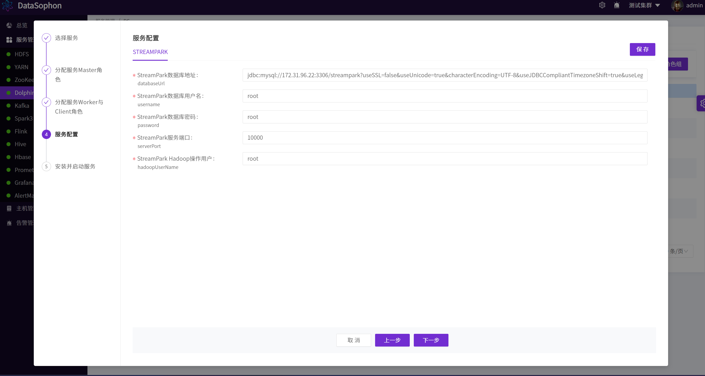
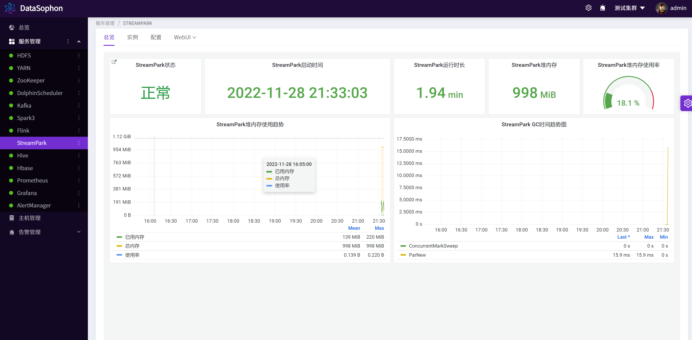
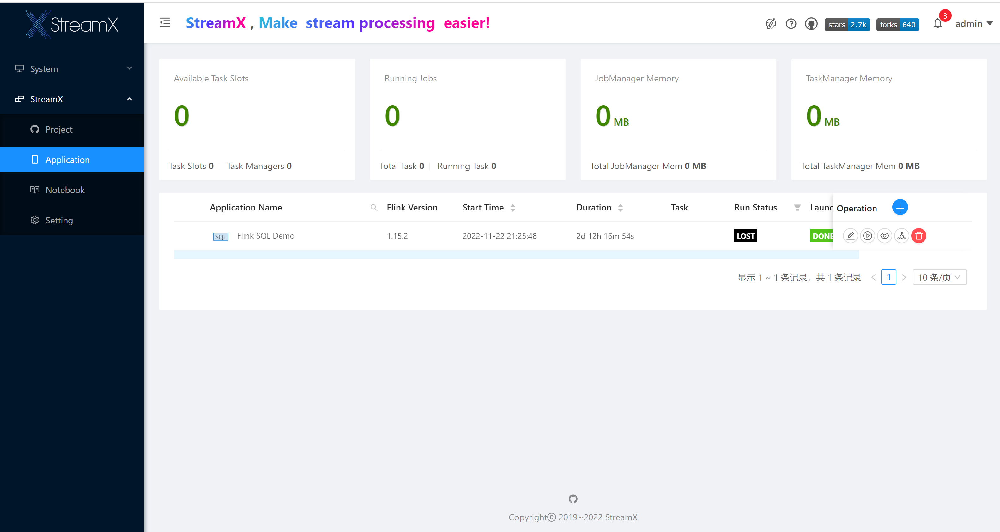

# 添加StreamPark

初始化StreamPark数据库。

```
CREATE DATABASE streampark DEFAULT CHARACTER SET utf8 DEFAULT COLLATE utf8_general_ci;
GRANT ALL PRIVILEGES ON streampark.* TO 'streampark'@'%' IDENTIFIED BY 'streampark';
GRANT ALL PRIVILEGES ON streampark.* TO 'streampark'@'localhost' IDENTIFIED BY 'streampark';
flush privileges;
```

执行/opt/datasophon/DDP/packages目录下**streampark.sql**创建streampark数据库表。

添加StreamPark。



根据实际情况修改配置。



安装成功后可查看StreamPark总览页面，可通过WebUi跳转到StreamPark用户页面。




