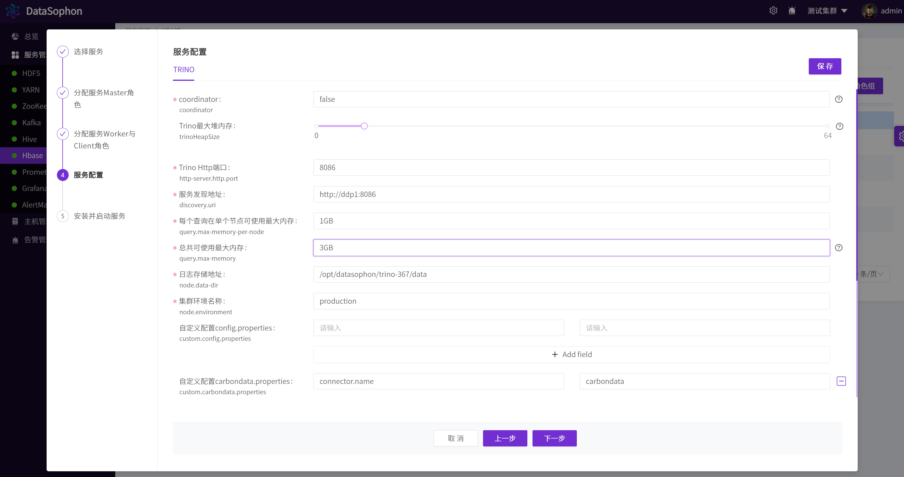

# 添加Trino

点击【添加服务】，选择Trino。

选择TrinoCoordinator。

选择TrinoWorker。注意：TrinoCoordinator和TrinoWorker不要部署在同一台机器上。

注意"Trino最大堆内存"，"每个查询在单个节点可使用最大内存"这两个配置，其中"每个查询在单个节点可使用最大内存"不可超过"Trino最大堆内存"的80%，"总共可使用最大内存"为"每个查询在单个节点可使用最大内存"* TrinoWorker数。

点击【下一步】，开始安装Trino。

