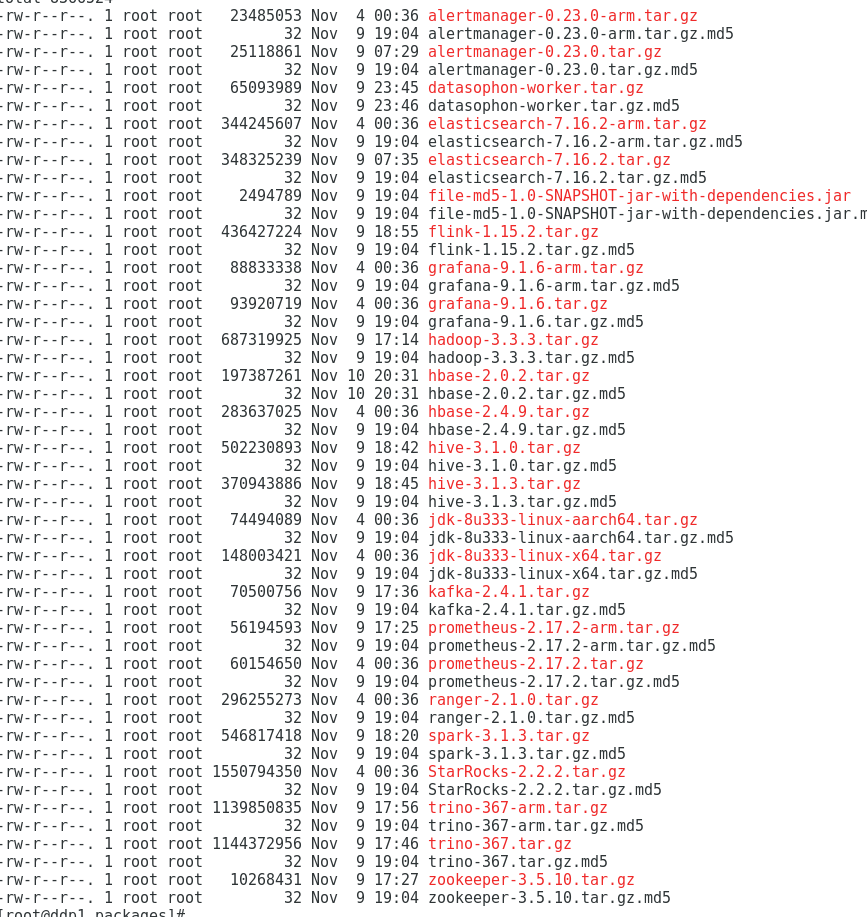

## Deployment mysql

Notice Disable the mysql ssl function.During the deployment,Some components execute sql to generate library tables,The configuration of mysql in different environments varies,You can change the mysql configuration based on the sql execution.

## Execute data script

```
CREATE DATABASE IF NOT EXISTS datasophon DEFAULT CHARACTER SET utf8;
grant all privileges on *.* to datasophon@"%" identified by 'datasophon' with grant option;
GRANT ALL PRIVILEGES ON *.* TO 'datasophon'@'%';
FLUSH PRIVILEGES;
```


Run datasophon.sql in the sql directory of the datasophon-manager installation directory to create the data table.

## Install nginx

Provide server configuration for nginx.conf.

```
 server {
                listen 8888;# Access port (modify yourself)
                server_name localhost;
                #charset koi8-r;
                #access_log /var/log/nginx/host.access.log main;
                location / {
                        root /usr/local/nginx/dist; # dist directory address extracted on the front end (modify yourself)
                        index index.html index.html;
                }
                location /ddh {
                        proxy_pass http://ddp1:8081; # Interface address (modify by yourself)
                        proxy_set_header Host $host;
                        proxy_set_header X-Real-IP $remote_addr;
                        proxy_set_header x_real_ipP $remote_addr;
                        proxy_set_header remote_addr $remote_addr;
                        proxy_set_header X-Forwarded-For $proxy_add_x_forwarded_for;
                        proxy_http_version 1.1;
                        proxy_connect_timeout 4s;
                        proxy_read_timeout 30s;
                        proxy_send_timeout 12s;
                        proxy_set_header Upgrade $http_upgrade;
                        proxy_set_header Connection "upgrade";
                }

                #error_page 404 /404.html;
                # redirect server error pages to the static page /50x.html
                #
                error_page 500 502 503 504 /50x.html;
                location = /50x.html {
                        root /usr/share/nginx/html;
                }
        }
```

Unzip dist.zip to the nginx directory,Start nginx.

## Download the DDP deployment package

DDP deployment package download address:

link:https://pan.baidu.com/s/1-Te6TuZoTbA5wccy7xRr5A?pwd=uq91 
Extraction code:uq91

Create a directory in the /opt/datasophon directory

```
mkdir -p /opt/datasophon/DDP/packages
```

Upload download a deployment package to/opt/datasophon/DDP/packages directory,As the project deployment package repository address.



## Deploy DataSophon

### 1 Deployment Directory Introduction

Decompress datasophon-manager-{version}.tar.gz in the installation directory,After decompression, the following installation directories are displayed:

 

bin:Startup script git

conf:Configuration file

lib:The jar package that the project depends on

logs:Project log directory

jmx:jmx plugin

### 2 Modify the configuration

Modify the database link configuration in the application.yml configuration file in the conf directory:

```
spring:
  datasource:
    type: com.alibaba.druid.pool.DruidDataSource
    url: jdbc:mysql:ddp1:3306/datasophon?useUnicode=true&characterEncoding=utf-8
    username: root
    password: ddp1
    driver-class-name: com.mysql.jdbc.Driver
```

### 3 Start service

```
start：sh bin/datasophon-api.sh start api
stop：sh bin/datasophon-api.sh stop api
restart：sh bin/datasophon-api.sh restart api
```

After the deployment is successful, logs can be viewed. Logs are stored in the logs folder:

 logs/

  ├── ddh-api.log

  ├── ddh-api-error.log

  |—— api-{hostname}.out

## Access page

Access the front-end page address,Interface ip(modify by yourself) [http://192.168.xx.xx:8](http://192.168.xx.xx:12345/dolphinscheduler)888，The default user name and password are admin and admin123

## More details

* Contact:

