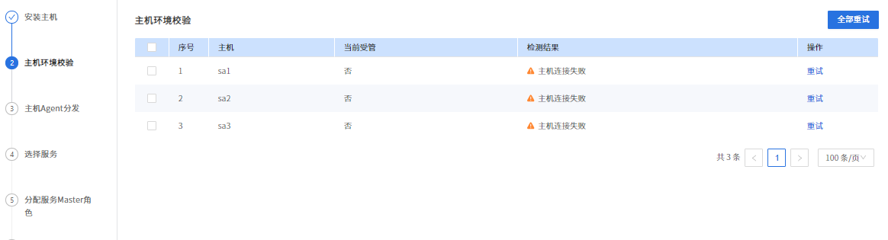

## 1、主机环境校验-主机连接失败



**解决办法：**

一、检查环境配置

- 使用该命令创建免密登录

```
 ssh-keygen -m PEM -t rsa
```

- 第一步输入的主机名与hostnamectl set-hostname 主机名保持一致。

二、查询操作系统OpenSSH版本。

   DataSophon使用jsch进行远程主机连接，jsch与openssh版本存在兼容问题，会导致主机连接失败。若出现因OpenSsh版本过高，可通过**手动部署DataSophon Worker的方式自动跳过主机连接校验与主机agent分发两个步骤，手动部署Worker时，DataSophon Manager需为启动状态**。

三、手动部署worker步骤：

1、修改worker conf目录下common.properties配置文件，主要修改注释部分配置。

```
language=chinese
install.path=/opt/datasophon
masterHost=ddp123               #datasophon manager节点hostname
masterWebPort=8081              #datasophon manager端口
frameCode=DDP-1.1.1             #DDP版本
clusterId=17				    #集群id，可以从t_ddh_cluster_info表中查询
rows=200
times=20
timeOutPeriodOne=1
timeOutPeriodTwo=2
HADOOP_HOME=/opt/datasophon/hadoop-3.3.3
```

2、启动worker

```
bin/datasophon-worker.sh start worker
```

通过tail -100f  logs/worker-{hostname}.out查看worker日志

