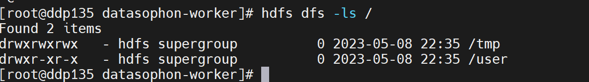

# 1、HDFS启用Kerberos

开启HDFS安全认证前使用HDFS命令：

打开HDFS配置页面，点击**开启Kerberos**后保存配置。注意：**一定要保存配置！！！**

保存配置后重启HDFS。

2、YARN启用Kerberos

3、ZooKeeper启用Kerberos

4、Kafka启用Kerberos

5、Hive启用Kerberos

6、HBase启用Kerberos
