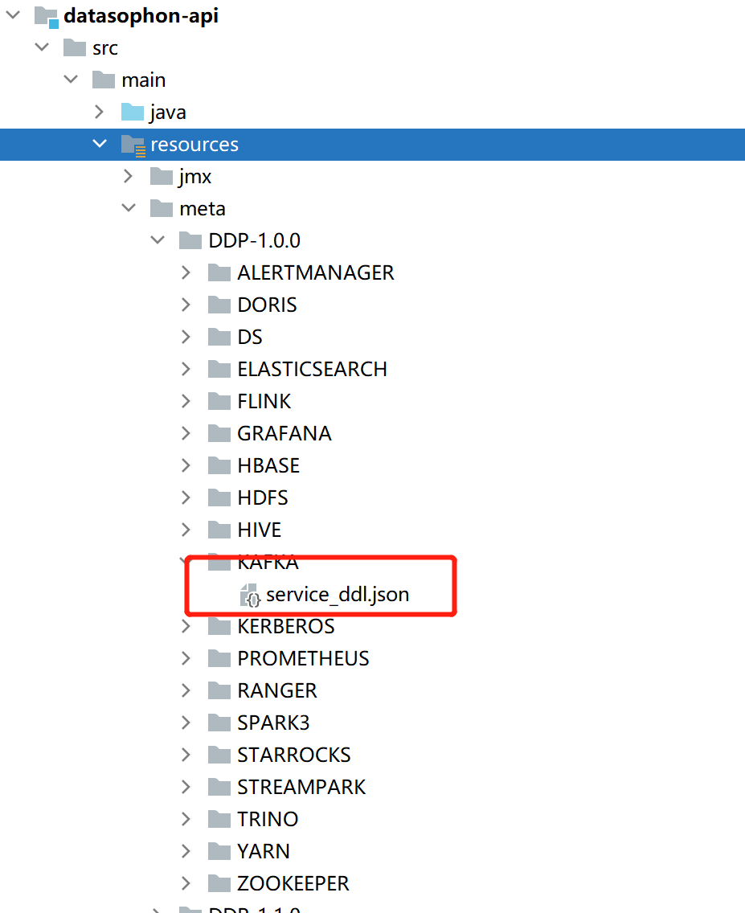

## 1、服务集成协议

DataSophon支持以配置的形式集成第三方组件。当前以集成Kafka组件为例，详细介绍服务集成协议。

首先在meta/DDP-1.0.0目录下创建KAFKA目录和service_ddl.json服务集成文件。



其次，编写服务集成json文件。

```
{
  "name": "KAFKA",                           #服务名称
  "label": "Kafka",
  "description": "高吞吐量的分布式发布订阅消息系统",
  "version": "2.4.1",
  "sortNum": 4,
  "dependencies":["ZOOKEEPER"],              #服务依赖
  "packageName": "kafka-2.4.1.tar.gz",       #服务安装包名称
  "decompressPackageName": "kafka-2.4.1",    #服务安装包解压后名称，默认安装在/opt/datasophon目录下
  "roles": [                                 #服务角色列表
    {
      "name": "KafkaBroker",                 #Kafka的服务角色，KafkaBorker
      "label": "KafkaBroker",
      "roleType": "master",                  #Kafka的服务角色类型，有master , worker 和client三种角色。
      "cardinality": "1+",                   #1+表示可部署多个，1表示只能部署一个
      "logFile": "logs/server.log",      #KafkaBroker角色日志路径，/opt/datasophon/kafka-2.4.1/logs/server.log
      "jmxPort": 9991,
      "startRunner": {
        "timeout": "60",
        "program": "bin/kafka-server-start.sh", #KafkaBroker角色启动脚本
        "args": [
          "-daemon",
          "./config/server.properties"
        ]
      },
      "stopRunner": {
        "timeout": "600",
        "program": "bin/kafka-server-stop.sh",
        "args": [
        ]
      },
      "statusRunner": {
        "timeout": "60",
        "program": "bin/kafka-server-status.sh",
        "args": [
        ]
      },
      "restartRunner": {
        "timeout": "60",
        "program": "control.sh",
        "args": [
          "restart",
          "namenode"
        ]
      }
    }
  ],
  "configWriter": {        #Kafka配置文件定义
    "generators": [
      {
        "filename": "server.properties",
        "configFormat": "properties",
        "outputDirectory": "config",
        "includeParams": [
          "log.dirs",
          "num.partitions",
          "offsets.topic.replication.factor",
          "log.retention.hours",
          "zookeeper.connect",
          "default.replication.factor",
          "auto.create.topics.enable",
          "unclean.leader.election.enable",
          "auto.leader.rebalance.enable",
          "message.max.bytes",
          "replica.fetch.max.bytes",
          "num.network.threads",
          "num.io.threads",
          "queued.max.requests",
          "socket.receive.buffer.bytes",
          "socket.send.buffer.bytes",
          "socket.request.max.bytes",
          "custom.server.properties"
        ]
      },
      {
        "filename": "kafka-server-start.sh",
        "configFormat": "custom",
        "outputDirectory": "bin",
        "templateName": "kafka-server-start.ftl",
        "includeParams": [
          "kafkaHeapSize"
        ]
      }
    ]
  },
  "parameters": [        #Kafka服务参数定义
    {
      "name": "log.dirs",
      "label": "kafka数据存储目录",
      "description": "",
      "required": true,
      "type": "multiple",
      "value": ["/data/kafka-logs"],
      "configurableInWizard": true,
      "hidden": false,
      "defaultValue": ""
    },
    {
      "name": "kafkaHeapSize",
      "label": "Kafka堆内存大小",
      "description": "Kafka堆内存大小",
      "configType": "map",
      "required": true,
      "minValue": 0,
      "maxValue": 24,
      "type": "slider",
      "value": "",
      "unit": "GB",
      "configurableInWizard": true,
      "hidden": false,
      "defaultValue": "6"
    },
    {
      "name": "num.partitions",
      "label": "分区数",
      "description": "",
      "required": true,
      "type": "input",
      "value": "",
      "configurableInWizard": true,
      "hidden": false,
      "defaultValue": "8"
    },{
      "name": "offsets.topic.replication.factor",
      "label": "内置topic副本数",
      "description": "",
      "required": true,
      "type": "input",
      "value": "",
      "configurableInWizard": true,
      "hidden": false,
      "defaultValue": "2"
    },{
      "name": "log.retention.hours",
      "label": "数据保留的最长时间",
      "description": "",
      "required": true,
      "type": "input",
      "value": "",
      "configurableInWizard": true,
      "hidden": false,
      "defaultValue": "168"
    },
    {
      "name": "zookeeper.connect",
      "label": "zk连接地址",
      "description": "",
      "required": true,
      "type": "input",
      "value": "${zkUrls}",
      "configurableInWizard": true,
      "hidden": false,
      "defaultValue": ""
    },{
      "name": "default.replication.factor",
      "label": "topic副本数",
      "description": "",
      "required": true,
      "type": "input",
      "value": "",
      "configurableInWizard": true,
      "hidden": false,
      "defaultValue": "2"
    },
    {
      "name": "auto.create.topics.enable",
      "label": "启用自动创建topic",
      "description": "",
      "required": true,
      "type": "switch",
      "value": "",
      "configurableInWizard": true,
      "hidden": false,
      "defaultValue": false
    },
    {
      "name": "unclean.leader.election.enable",
      "label": "是否允许Unclean Leader选举",
      "description": "是否允许落后较多的副本参加leader选举",
      "required": true,
      "type": "switch",
      "value": "",
      "configurableInWizard": true,
      "hidden": false,
      "defaultValue": false
    },
    {
      "name": "auto.leader.rebalance.enable",
      "label": "是否允许Leader重平衡",
      "description": "设置它的值为true表示允许Kafka定期地对一些Topic分区进行Leader重选举",
      "required": true,
      "type": "switch",
      "value": "",
      "configurableInWizard": true,
      "hidden": false,
      "defaultValue": true
    },
    {
      "name": "message.max.bytes",
      "label": "Broker能够接收的最大消息大小",
      "description": "",
      "required": true,
      "type": "input",
      "value": "",
      "configurableInWizard": true,
      "hidden": false,
      "defaultValue": "1000012"
    },
    {
      "name": "replica.fetch.max.bytes",
      "label": "Broker可复制的最大消息大小",
      "description": "kafka接收单个消息size的最大限制,默认为1M左右 message.max.bytes必须小于等于replica.fetch.max.bytes",
      "required": true,
      "type": "input",
      "value": "",
      "configurableInWizard": true,
      "hidden": false,
      "defaultValue": "1048576"
    },
    {
      "name": "num.network.threads",
      "label": "处理网络请求的网络线程数目",
      "description": "server用来处理网络请求的网络线程数目；一般你不需要更改这个属性。",
      "required": true,
      "type": "input",
      "value": "",
      "configurableInWizard": true,
      "hidden": false,
      "defaultValue": "3"
    },
    {
      "name": "num.io.threads",
      "label": "处理io请求的线程数目",
      "description": "server用来处理请求的I/O线程的数目；这个线程数目至少要等于硬盘的个数。",
      "required": true,
      "type": "input",
      "value": "",
      "configurableInWizard": true,
      "hidden": false,
      "defaultValue": "12"
    },
    {
      "name": "queued.max.requests",
      "label": "等待执行的io请求最大数目",
      "description": "在网络线程停止读取新请求之前，可以排队等待I/O线程处理的最大请求个数。",
      "required": true,
      "type": "input",
      "value": "",
      "configurableInWizard": true,
      "hidden": false,
      "defaultValue": "500"
    },
    {
      "name": "socket.receive.buffer.bytes",
      "label": "socket接收服务的缓存区大小",
      "description": "socket接收服务的缓存区大小",
      "required": true,
      "type": "input",
      "value": "",
      "configurableInWizard": true,
      "hidden": false,
      "defaultValue": "102400"
    },
    {
      "name": "socket.send.buffer.bytes",
      "label": "socket发送服务的缓存区大小",
      "description": "socket发送服务的缓存区大小",
      "required": true,
      "type": "input",
      "value": "",
      "configurableInWizard": true,
      "hidden": false,
      "defaultValue": "102400"
    },
    {
      "name": "socket.request.max.bytes",
      "label": "socket每次请求的最大字节数",
      "description": "socket每次请求的最大字节数",
      "required": true,
      "type": "input",
      "value": "",
      "configurableInWizard": true,
      "hidden": false,
      "defaultValue": "102857600"
    },
    {
      "name": "custom.server.properties",
      "label": "自定义配置server.properties",
      "description": "自定义配置",
      "configType": "custom",
      "required": false,
      "type": "multipleWithKey",
      "value": [],
      "configurableInWizard": true,
      "hidden": false,
      "defaultValue": ""
    }
  ]
}
```

参考该协议，可以很方便的集成第三方组件，将第三方组件的配置和服务监控，启停管理托管到DataSophon上。

## 2、集成Jmx监控

## 3、绘制Grafana图表

## 4、开始添加服务

## 5、添加自定义告警
