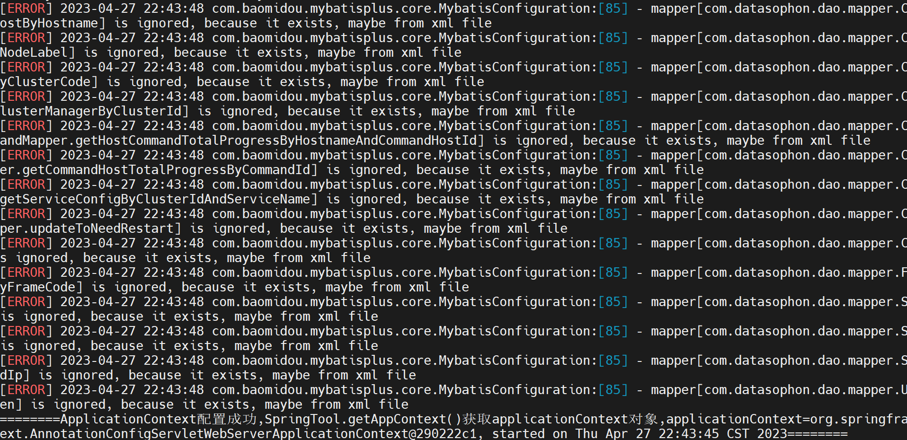

## 1. 本地部署

### 1.1 文件结构

首先解压安装包

```shell
tar -zxvf datasophon-manager-{version}.tar.gz
```

解压之后的文件结构如下
```shell
├── bin               # 执行脚本目录
├── conf              # 配置文件目录
├── lib               # 项目依赖目录
├── (logs)            # 日志目录；应用运行后生成
├── jmx               # jmx插件目录
├── datasophon-init   # 环境初始化脚本
├── README.md         # 读我说明
├── Dockerfile        # 容器构建脚本
└── LICENSE
```

### 1.2 配置应用数据库

注意需关闭mysql ssl功能。在部署过程中，部分组件会执行sql生成库表，不同环境的mysql在配置上存在差异，可根据sql执行情况，变更mysql配置。

1. 创建数据库, 指定数据库编码为UTF-8
```
CREATE DATABASE IF NOT EXISTS datasophon DEFAULT CHARACTER SET utf8;
grant all privileges on *.* to datasophon@"%" identified by 'datasophon' with grant option;
GRANT ALL PRIVILEGES ON *.* TO 'datasophon'@'%';
FLUSH PRIVILEGES;
```
**注意：1.1.3 版本以前，需要手动执行sql/datasophon.sql来初始化数据库。此版本及以上版本，创建好数据库即可，在初次连接时会自动初始化数据库**

**首次连接数据库(或者版本升级)时,建议使用一个权限较高的数据库账号登录(建议 root 账号)。因为首次连接会执行数据库初始化脚本，如果使用的数据库账号权限太低，会导致数据库初始化失败**


2. 编辑 `conf/datasophon.conf` 文件完成配置

```shell
datasource.ip=localhost           # 数据库IP或域名
datasource.port=3306              # 数据库端口
datasource.database=datart        # 数据库名称
datasource.username=root          # 用户名
datasource.password=root          # 密码

server.port=                      # 服务启动端口(可选)
```

### 1.3 下载DDP部署包

DDP部署包下载地址：

链接：https://pan.baidu.com/s/1GREAydTUrfcyXhn_Hr-9xw?pwd=bj7k 
提取码：bj7k 

在/opt/datasophon目录下创建目录

```
mkdir -p /opt/datasophon/DDP/packages
```

将下载的部署包上传(或者使用软链)到/opt/datasophon/DDP/packages目录下，作为项目部署包仓库地址。


### 启动DataSophon

```
启动：sh bin/datasophon-api.sh start api
停止：sh bin/datasophon-api.sh stop api
重启：sh bin/datasophon-api.sh restart api
```

部署成功后，可以进行日志查看，日志统一存放于logs文件夹内:

 logs/

  ├── ddh-api.log

  ├── ddh-api-error.log

  |—— api-{hostname}.out

**项目启动后会出现mapper异常，该异常对项目无影响，可忽略。**



### 1.4 访问页面

访问前端页面地址,接口ip(自行修改) [http://192.168.xx.xx:8081/ddh，默认用户名和密码为admin/admin123


## 2. Docker部署

DataSophon支持Docker 和 Docker-Compose 部署,在解压发布包后,内部自带 Dockerfile 用于构建镜像

### 2.1 构建镜像

```shell
docker build -t datasophon/datasophon:dev .
```

### 2.2 挂载配置

DataSophon 在启动时还需要数据库和DDP部署包才可以真正的进行使用

数据库的挂载路径为 `/datasophon/conf/datasophon.conf`
DDP部署包的挂载路径为 `/opt/datasophon/DDP/packages`, 由于部署包文件较大,需要另外下载


### 2.3 启动应用

当以上的配置准备就绪后,就可以在启动命令中增加挂载参数。以下是完整命令：

```shell
docker run -d --name datasophon -v your_path/datasophon.conf:/datasophon/conf/datasophon.conf -v your_path/DDP:/opt/datasophon/DDP/packages -p 8081:8081 datasophon/datasophon
```

镜像启动成功后，在浏览器中访问 <http://docker_ip:8081/ddh> 进入登录页。 默认用户名和密码为admin/admin123


## 3. 详细配置

DataSophon 的所有应用配置文件在 conf 目录下。如果需要使用 DataSophon 的全部功能，在这之前先了解一下如何进行配置

conf 目录结构如下：

|-- datasophon.conf
|-- logback-api.xml
|-- common.properties
|-- profiles
|   |-- application-config.yml
datasophon.conf 为快捷配置文件；如果你只想快速体验 DataSophon 的功能，配置它就足够了。datasophon.conf 本质上是 application-config.yml 中常用配置的快捷方式
logback-api.xml 为日志配置文件
application-config.yml 为应用配置文件，包含所有的应用配置。

### 3.1 快捷配置
datasophon.conf 为快捷配置文件；所有配置参数如下：
```shell
# ====== 应用数据库配置 ======
# 数据库IP或域名
datasource.ip=localhost
# 数据库端口
datasource.port=3306
# 数据库名称
datasource.database=datasophon
# 用户名
datasource.username=root
# 密码
datasource.password=root
# ====== 应用服务器配置 ======
# 服务器端口
server.port=8081
# 服务器地址
#   Web 服务所绑定的本机网卡地址，一般为内网地址
server.address=0.0.0.0
```

### 3.2 应用配置
application-config.yml 为应用配置文件，里面包含 datart 应用的所有配置。datart.conf 中的内容实际上是 application-config.yml 部分配置项的快捷方式。

在编辑配置时需要注意以下事项：

一定要严格遵循 yml 格式，注意空格与缩进，错误配置会导致程序无法正常启动
application-config.yml 直接由 spring-boot 处理，其中的 oauth2, redis, mail 等配置项完全遵循 spring-boot-autoconfigure 配置

#### 3.2.1 应用数据库配置
spring.datasource 为应用数据库配置
```yaml
spring:
  datasource:
    # 驱动类名称
    driver-class-name: com.mysql.cj.jdbc.Driver
    # 数据源类型
    type: com.alibaba.druid.pool.DruidDataSource
    # 连接字符串
    url: jdbc:mysql://${datasource.ip:localhost}:${datasource.port:3306}/${datasource.database:datasophon}?&allowMultiQueries=true&characterEncoding=utf-8
    # 用户名
    username: ${datasource.username:datasophon}
    # 密码
    password: ${datasource.password:datasophon}
```

默认情况下，会读取 datasophon.conf 中的应用数据库配置项填充到模板中

#### 3.2.2 应用服务器配置

```yaml
server:
  # Web 服务绑定端口
  port: ${server.port:8081}
  # Web 服务绑定地址
  address: ${server.ip:0.0.0.0}
```
需要注意，所绑定的地址为本地网卡 IP 地址，一般为内网地址

同样在默认情况下，会读取 datasophon.conf 中的应用服务器配置项填充到模板中

#### 3.2.3 datart 全局配置

```yaml
datasophon:
  # 是否自动执行数据库升级脚本
  migration:
    enable: true

```
