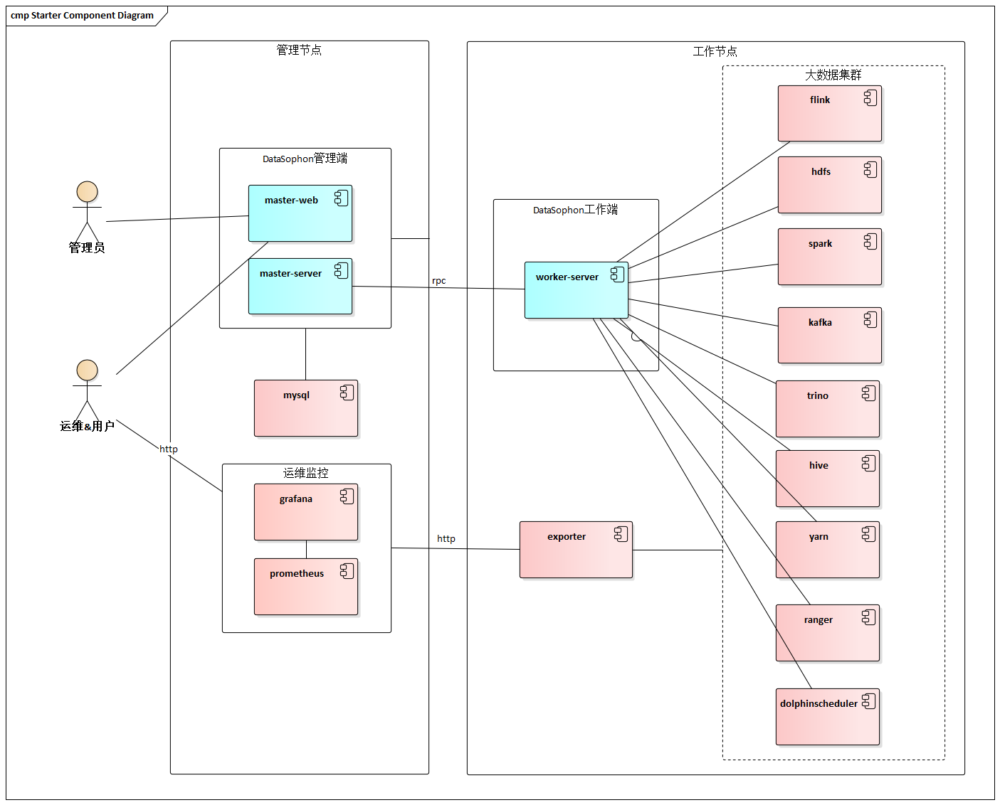

# DataSophon

## 愿景
致力于快速实现部署、管理、监控以及自动化运维大数据云原生平台，帮助您快速构建起稳定、高效、可弹性伸缩的大数据云原生平台。

## DataSophon是什么
《三体》，这部获世界科幻文学最高奖项雨果奖的作品以惊艳的"硬科幻"风被大家所熟知，其作者刘慈欣更是被誉为"单枪匹马将中国科幻提高到世界级水平"。

作为三体中非常重要的角色，智子(Sophon)是将九维的质子进行二维展开，通过电路蚀刻改造成超级计算机后，再转回到微观的十一维来监控人类的一举一动，并利用量子纠缠实现瞬时通信报告给4光年之外的三体文明。说白了智子是三体文明部署在地球的AI实时远程监控和管理平台。

DataSophon也是个类似的管理平台，只不过与智子不同的是，智子的目的是锁死人类的基础科学阻碍人类技术爆炸，而DataSophon是致力于自动化监控、运维、管理大数据基础组件和节点的，帮助您快速构建起稳定，高效的大数据集群服务。

主要特性有:

* 极易部署,可快速完成300个节点的大数据集群部署
* 国产化兼容,兼容arm服务器和常用国产化操作系统
* 监控指标全面丰富，基于生产实践展示用户最关心的监控指标
* 灵活便捷的告警服务，可实现用户自定义告警组和告警指标
* 可扩展性强，用户可通过配置的方式集成或升级大数据组件

## 整体架构

## 集成组件

各集成组件均进行过兼容性测试，并稳定运行于300+个节点规模的大数据集群，日处理数据量约4000亿条。

| 序号 |       名称        |  版本  |                       描述                       |
| :--: | :---------------: | :----: | :----------------------------------------------: |
|  1   |       HDFS        | 3.3.3  |                 分布式大数据存储                 |
|  2   |       YARN        | 3.3.3  |             分布式资源调度与管理平台             |
|  3   |     ZooKeeper     | 3.5.10 |                  分布式协调系统                  |
|  4   |       FLINK       | 1.15.2 |                   实时计算引擎                   |
|  5   | DolphoinScheduler | 3.1.1  |      分布式易扩展的可视化工作流任务调度平台      |
|  6   |    StreamPark     | 1.2.3  | 流处理极速开发框架,流批一体&湖仓一体的云原生平台 |
|  7   |       Spark       | 3.1.3  |                  分布式计算系统                  |
|  8   |       Hive        | 3.1.0  |                   离线数据仓库                   |
|  9   |       Kafka       | 2.4.1  |          高吞吐量分布式发布订阅消息系统          |
|  10  |       Trino       |  367   |             分布式Sql交互式查询引擎              |
|  11  |     StarRocks     | 2.2.2  |            新一代极速全场景MPP数据库             |
|  12  |       Hbase       | 2.0.2  |               分布式列式存储数据库               |
|  13  |      Ranger       | 2.1.0  |                   权限控制框架                   |
|  14  |   ElasticSearch   | 7.16.2 |                  高性能搜索引擎                  |
|  15  |    Prometheus     | 2.17.2 |           高性能监控指标采集与告警系统           |
|  16  |      Grafana      | 9.1.6  |             监控分析与数据可视化套件             |
|  17  |   AlertManager    | 0.23.0 |                 告警通知管理系统                 |

